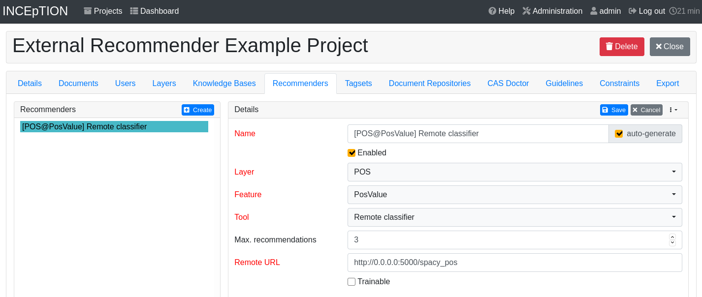
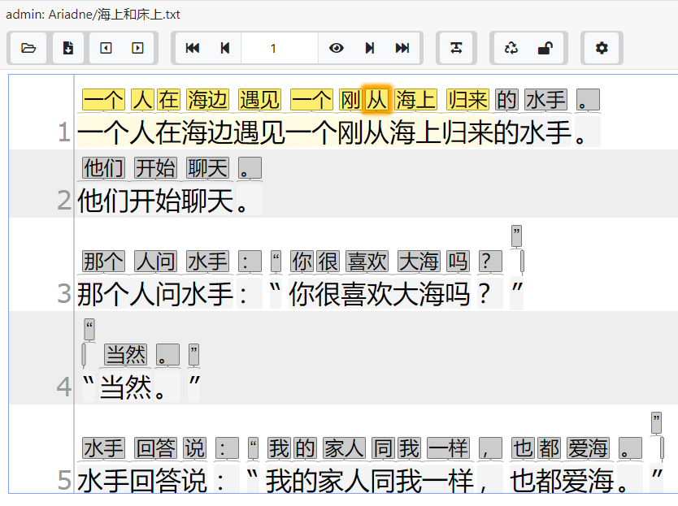
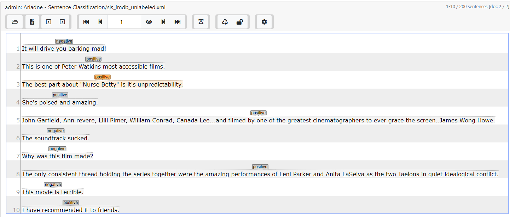

# inception-external-recommender

This repository provides **[ariadne](https://inception.fandom.com/wiki/Ariadne)**, a library 
to run and implement external recommenders for INCEpTION using Python.

You can watch external recommender in action in the follwing video:

## Install required packages
For installing the required packages we provide a `setup.py` to simplify the process. To install
the basic requirements just run 
    
    pip install -e .

There are further requirements which need to be fulfilled depending on the use case. They are
listed and explained below:

* `contrib` for being able to use the provided already usable external recommenders (for a
 detailed overview see [Contrib Models](#contrib-models) below)
* `test` for being able to use the tests
<!--- * `doc` for being able to build the documentation % -->
* `dev` for being able to develop this package

To install for example the `contrib` dependencies run:
    
    pip install -e ".[contrib]"
 
## Starting a simple recommender

We provide multiple ready to use recommenders. A full overview of them can be found at [Contrib
 Models](#contrib-models).
 
In this section we provide an example on how to start a server with two recommenders, one for
named entities and one for parts-of-speech. They both use [spaCy](https://spacy.io/) and are
not trainable. 

Be aware that the english spacy model needs to be downloaded previously. This can be done by
running:
    
    python -m spacy download en_core_web_sm 

Then you can use this example code to start the server:

    from ariadne.contrib.spacy import SpacyNerClassifier, SpacyPosClassifier
    from ariadne.server import Server
      
    server = Server()
    server.add_classifier("spacy_ner", SpacyNerClassifier("en_core_web_sm"))
    server.add_classifier("spacy_pos", SpacyPosClassifier("en_core_web_sm"))

    server.start()
    
The external recommenders are afterwards reachable under `http://localhost:5000/spacy_ner` and 
`http://localhost:5000/spacy_pos` respectively.

To add them to your INCEpTION-project open its settings page and choose the tab *Recommenders*. 
Click on *Create* to create a new recommender. Then choose its properties according to the
picture below to add the part-of-speech recommender. Its name is generated automatically.
 

  

Click *Save* and open a text for annotation. After performing an action, e.g. making an
annotation, the recommendations are shown above the tokens. Adding the named-entity recommender
works similarly. A detailed description for using a recommender can be found in the 
[INCEpTION user guide](https://inception-project.github.io/releases/21.1/docs/user-guide.html). 
    
## Building your own recommender

See `ariadne/contrib/sklearn.py` for examples.

## Deployment

In order to support multiple users at once, the recommender server needs to be started on
a wsgi server. This can e.g. be done via [gunicorn](https://gunicorn.org/). We provide an
example in `wsgi.py` which can be run on `gunicorn` via

    gunicorn -w 4 -b 127.0.0.1:5000 wsgi:app
    
This runs the recommendation server with 4 workers, that means at least 4 users can use the 
server at the same time. Make sure to scale this to your needs. Also adjust the IP adress
the server is listening on. `0.0.0.0` exposes it to your network!

## Contrib Models

Multiple different models have already been implemented and are ready for you to use. The
following table provides an overview about them:

| Classname | Description | Trainable |
| --------- | ----------- | --------- |
| JiebaSegmenter | Chinese segmentation prediction with [Jieba](https://github.com/fxsjy/jieba) | no |
| LevenshteinStringMatcher | "Fuzzy" string matching | yes |
| NltkStemmer | Word stemming prediction with [NLTK](https://www.nltk.org/), using its PorterStemmer | no |
| SklearnMentionDetector | Mention detection with [sklearn-crfsuite](https://github.com/TeamHG-Memex/sklearn-crfsuite), using a conditional random field, trained with gradient descent using the L-BFGS method | yes |
| SklearnSentenceClassifier | Sentence classification with [scikit-learn](https://scikit-learn.org/stable/), using its multinominal naive bayes classifier and  TF-IDF counts as features | yes |
| SpacyNerClassifier | Named-entity prediction with [spaCy](https://spacy.io/) | no |
| SpacyPosClassifier | Part-of-speech prediction with [spaCy](https://spacy.io/) | no |
| AdapterSequenceTagger | Sequence tagger using [Adapters](https://adapterhub.ml/) | no |
| AdapterSentenceClassifier | Sentence classifier using [Adapters](https://adapterhub.ml/) | no |

For using trainable recommenders it is important to check the checkbox *Trainable* when adding
the external recommender to your project. To be able to get predictions of a added trainable
recommenders you need to start creating annotations in the corresponding layer. 
Afterwards click on the speechbubble-symbol (*Recommendation*) on the left side and choose *Save* 
to train the recommender. Now new predictions will be displayed.

The contrib models are an example and are intended to be used with INCEpTION, therefore they might not be a
100% fit for you, e.g. `create_prediction`. If your project uses a different type system than DKPro, then you can
alter the variables in `inception_util.py`.

### Jieba Segmenter

This recommender uses [Jieba](https://github.com/fxsjy/jieba) for predicting Chinese segmentation.

  

### S-BERT sentence classifier

This recommender uses [S-BERT](https://github.com/UKPLab/sentence-transformers) together with
[LightGBM](https://lightgbm.readthedocs.io/en/latest/) for sentence classification.

  

## Development

The following section describes how to develop your own recommender. **inception-recommender** 
comes with example requests which can be found in `examples/requests`.

### Tester

The tester allows to send different requests to your external recommender, thereby you
do not need to run INCEpTION during (early) development.

    $ python scripts/tester.py train -h
    usage: tester.py [-h] [-u USER] {train,predict}
    
    Test your INCEpTION external recommender.
    
    positional arguments:
      {train,predict}       The request type you want to use.
    
    optional arguments:
      -h, --help            show this help message and exit
      -u USER, --user USER  The user issuing the request.
      
### Developing in deployment setting

The simplest way to develop in deployment setting, that is using `gunicorn` is to just run

    make gunicorn
    
This starts `gunicorn` with 4 workers and hot-code reloading.
